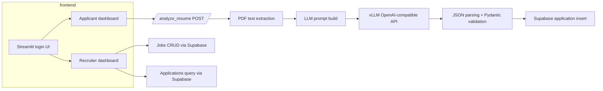

# Building Resume Compact: My First AI Resume Screening System

I built this during a weekend hackathon because I wanted to see how far a local LLM could get with a real PDF resume.

The core idea is annoying in practice: make a PDF readable, send the text to a model, and parse back HR-friendly JSON. In reality the code ended up spending more lines on extraction, parsing, and validation than on the model call itself.

## Why I built it

I needed a way to test a resume screening workflow without depending on OpenAI or a cloud API. This was the experiment: could I wire a Streamlit front end, a FastAPI backend, and a local `vLLM` server together so that a resume upload actually produced something useful?

The actual bug that woke me up at 2 a.m. was a PDF that returned zero text from `fitz`, even though it looked fine in Preview. That forced the OCR branch and exposed the first messy part of the pipeline.

## The initial idea

Originally I sketched this as a small app with a job page, upload button, and a deterministic model call.

I figured that the plumbing would be simple.

- receive a PDF upload in FastAPI
- try direct PDF text extraction first
- fall back to OCR only when necessary
- send resume text plus job description to the model
- parse a structured JSON object and store it

That’s still the end state, but the implementation has a few rough edges.

The first major reality check was the data surface: resumes contain arbitrary text, the extracted text can be garbage, and the LLM can still wrap the answer in markdown or extra prose. So the backend became defensive by accident.

## Project architecture

The repo ships as two rough pieces.

- Frontend: Streamlit app in `frontend/`
- Backend: FastAPI service in `main.py`
- Persistence: Supabase tables for `jobs` and `applications`
- Model inference: local OpenAI-compatible endpoint served by `vLLM`
- OCR / PDF handling: `PyMuPDF`, `pdf2image`, `pytesseract`

I chose Streamlit because I needed the UI done fast and I did not want to implement an SPA with auth flows. It is not pretty, but it is enough to exercise the workflow.

The backend is just one service with one main endpoint.

- `/analyze_resume`: accepts a PDF resume and a job description
- `/health`: basic health check

The actual workflow is: upload resume, extract text, build a prompt, call the model, parse the response, and store it.



### Frontend stack

The Streamlit app is split into three pieces:

- `frontend/app.py`: login flow and role-based dashboard routing
- `frontend/applicant.py`: resume upload and apply flow
- `frontend/recruiter.py`: job posting and application review

It uses a simple Supabase client in `frontend/utils/supabase_client.py` to fetch jobs and persist application records.

The frontend also contains a mocked Kafka publisher in `frontend/utils/api.py`, which is a signal that the architecture was intended to be event-driven but the integration was deferred.

### Backend stack

The backend uses FastAPI and several document-processing libraries:

- `fitz` from `PyMuPDF` for rapid text extraction from PDF objects
- `pdf2image` to render pages as images when direct extraction fails
- `pytesseract` for OCR fallback
- `langchain` StructuredPrompt for prompt construction
- `pydantic` for schema validation

The model is not accessed as a Python library. Instead, the app calls an HTTP endpoint at `http://localhost:8000/v1/chat/completions`.

That was also one of the dumbest practical choices: I could have used the model directly in Python, but I wanted to keep the backend decoupled enough to swap the model server later.

### Deployment and inference

There is no managed LLM in this repo. `cloudsetup.md` is basically the ops runbook for the local `vLLM` server.

The actual startup steps are:

1. SSH into the droplet
2. attach to the container
3. run `python -m vllm.entrypoints.openai.api_server --model Qwen/Qwen2.5-1.5B-Instruct --host 0.0.0.0 --port 8000 --dtype float16`
4. occasionally, run the same with `meta-llama/Llama-3.2-3B-Instruct`

That means the app is only useful if the inference service is up and the GPU container is healthy. For a hackathon demo, that is fine. For anything else, it is more deployment work than app work.

## How the AI system works

The messy part is the prompt pipeline in `main.py`.

### Resume text extraction first

`extract_text_from_pdf` is the part that made the demo stop working on actual PDFs.

It tries two strategies:

1. `fitz.open(stream=pdf_bytes, filetype='pdf')`
2. `pdf2image.convert_from_bytes` + `pytesseract.image_to_string`

This matters because a lot of resumes are either scanned or generated from a tool that strips text. I hit a case where `fitz` returned an empty string for a 12-page resume. The app did not fail elegantly; it just dropped the text and the first few runs were worthless.

So the code does this:

- use direct extraction if any page has text
- otherwise render images and OCR them

It logs both branches, which is why there is a call like:

```python
logger.info("Direct PDF extraction failed or produced no text. Attempting OCR-based extraction...")
```

That logging saved me from chasing the wrong bug for a while.

### Sanitizing untrusted input

I added `sanitize_input_text` because one of the sample resumes had what looked like prompt injection junk in the candidate’s cover letter.

It is not a robust defense. It strips lines matching regexes like:

- `ignore all previous instructions`
- `do not follow`
- `system prompt`
- `prompt injection`

That is a cheap fix. It still leaves a lot of attack surface, but it was enough to stop obvious garbage from reaching the model in the early demo.

### Structured prompt engineering

The prompt gets built with `StructuredPrompt.from_messages_and_schema`.

Instead of hand-writing the JSON shape, I serialize the Pydantic schema from `ResumeOutput` and include a template example. The model prompt basically says:

- return one JSON object
- no markdown
- no code fences
- match the schema exactly

That was the main guardrail for the LLM.

### Sending to the LLM

The API call is a plain HTTP POST to the local vLLM server.

The payload is locked down:

- `temperature: 0`
- `top_p: 1`
- `seed: 42`

I wanted the outputs to be repeatable while the rest of the pipeline was still fragile.

The backend also writes the raw response to `llm_response_*.json`. That was not theoretical — I used those files to debug the first time the model returned `Here is the JSON:` followed by a paragraph, and then the object.

### Parsing and validating the model output

`parse_json_from_text` exists because `choices[0].message.content` is not always a clean JSON string.

The code tries to:

1. strip markdown fences
2. remove a leading `json` label
3. pull the first `{...}` block out of the text

I saw results like:

> Here is the JSON you asked for:
> 
> ```json
> {"full_name":"Alice"...}
> ```

so this recovery logic was necessary.

After that, the result gets validated with:

```python
validated = ResumeOutput.model_validate(structured)
```

That is the core contract: if the model response does not match the schema, the endpoint fails rather than returning garbage to the frontend.

### The end-to-end flow

The applicant UI is basically a resume uploader and a score display.

The recruiter UI is a crude admin panel for jobs and applications. It is enough to see the structured output, but it is not a real product.

The demo path is:

1. upload a PDF
2. send it to `/analyze_resume`
3. write the structured data back to Supabase
4. render the recommendation and score in Streamlit

That is the actual value proposition, even if the UI is rough.

## Challenges and mistakes

This code has a few honest scraps in it.

### 1. PDF extraction is the most fickle part

I assumed resumes would arrive as text PDFs. That was wrong.

The first real failure mode was a resume that had `fitz` return an empty string for every page. The app still accepted the file, then the model got nothing useful and the result was garbage.

That is why the repo has a fallback to OCR.

The downside is that this adds real dependency pain:

- you need `tesseract` installed
- you need `poppler` for `pdf2image`
- OCR output is noisy and sometimes worse than no output

That bug taught me the model is the easy part if the input is broken.

### 2. Prompt injection defense is a bandaid

I added `sanitize_input_text` after seeing sample resume text that looked like a poor prompt injection attempt.

The function strips lines matching regexes like `ignore all previous instructions` and `system prompt`. It also turns ` ``` ` into ` `` `.

This is a weak fix. It helped with obvious bad examples, but it is not a real security control.

### 3. Parsing model output is the messy part

`parse_json_from_text` exists because the LLM does not consistently return clean JSON.

I saw outputs like:

> Here is the JSON you asked for:
>
> ```json
> {"full_name":"Alice" ... }
> ```

or the model would add a trailing `Thanks!` after the object.

So the code has to strip fences, trim a leading `json` label, and then extract the first `{...}` block.

If the model still fails validation, the endpoint returns 502 rather than letting junk flow into the UI.

### 4. Frontend auth is shallow

The Streamlit app uses `st.session_state` and a Supabase client. It is enough to demo recruiter vs applicant flows, but there is no real session management.

The schema even includes this note:

> If you are using the anon key without user contexts, leave RLS disabled.

That was a hackathon shortcut. It is okay for a prototype, but not for anything that needs basic security.

### 5. Ops is heavier than the app

This repo is not just Python code. It is a service that only works if a local `vLLM` server is running.

`cloudsetup.md` is basically the deploy checklist. It tells you to SSH into a droplet, exec into a container, and run the model server manually.

That is okay for a weekend project, but it means the deployment surface is much larger than a single Next.js or FastAPI app.

### 6. The repo is still in iteration mode

`README.md` says the LLM endpoint is `http://localhost:8000/v1/chat/completions`, while `main.py` defaults to `http://[IP_ADDRESS]/v1/chat/completions`.

That mismatch is the sort of thing you get when you keep moving the demo between machines and forget to clean up placeholders.

### 7. Kafka is not actually wired up

`frontend/utils/api.py` contains a `publish_to_kafka` stub with the real producer code commented out.

That is a strong signal that the event-stream architectural idea was shelved early in favor of getting the resume flow working.

## What I learned

This project taught me a few blunt lessons.

### The model is not the hardest part

That sounds cliché, but it is still true here.

Once the PDF text is extracted and the output schema is defined, the remaining code is about making the result usable. Everything from `fitz` failures to `pytesseract` garbage to model responses wrapped in markdown is more painful than the model inference itself.

### Metadata shape is worth enforcing

I am glad I used `ResumeOutput` for both the prompt and the backend validation.

The model may still produce junk, but at least the service has a contract. If the JSON does not validate, the endpoint fails fast instead of passing broken objects to the frontend.

### Hacks are fine for early demos

`sanitize_input_text` is ugly. The Kafka stub is obvious. The frontend auth is weak.

Those are all okay for a hackathon if they let you keep moving. The problem is when you forget that they are hacks and start treating them as architecture.

### Ops is real work

Deploying this meant more than running `uvicorn`.

`cloudsetup.md` is proof that the demo only works if the model server is up, the GPU container is healthy, and the droplet is reachable.

That is the part I would spend more time on next time.

### Determinism is useful here

The `temperature: 0` + `seed: 42` choice was deliberate.

For a structured output task, I wanted as little model randomness as possible while the rest of the codebase was still brittle.

## Future improvements

If I came back to this, I would fix the stuff that is actually broken first:

- enforce real auth and stop using anon Supabase access
- store raw resumes separately from the extracted text
- replace the regex-based prompt sanitization with a real input-normalization layer
- add retries and a fallback on model parse failures
- add a small evaluation set so I can measure whether the LLM output is improving or degenerating
- wire Kafka or another event stream properly instead of keeping it commented out
- add some simple observability around failed LLM responses and OCR errors

The next useful change is not another prompt wording tweak. It is the JSON parser and the validation loop.

## Conclusion

This is not a polished HR product.

It is a first pass on a flow where a resume PDF becomes a structured HR assessment, and most of the work was in getting the input and output to behave.

The model is only one part of the system. If nothing else, this repo is a reminder that a working AI app is still mostly brittle glue and operational detail.
